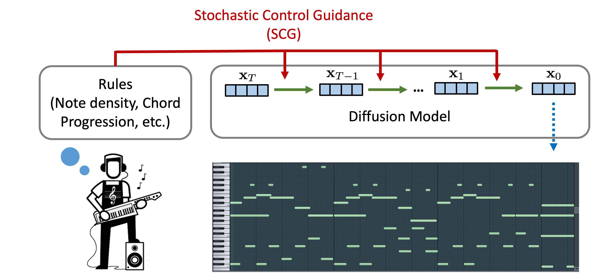

# Symbolic Music Generation with Non-Differentiable Rule Guided Diffusion

This is the codebase for the paper: [Symbolic Music Generation with Non-Differentiable Rule Guided Diffusion](https://arxiv.org/abs/2402.14285). 

We introduced a symbolic music generator with non-differentiable rule guided diffusion models,  drawing inspiration from stochastic control. For music demos, please visit our [project website](https://scg-rule-guided-music.github.io/).



## Set up the environment

- Put the pretrained VAE checkpoint under `taming-transformers/checkpoints`
- Create conda virtual environment via: `conda env create -f environment.yml`
- Activating virtual env: `conda activate guided`

## Download Pretrained Checkpoints
- Download the pretrained [VAE](https://drive.google.com/file/d/1MjCmgM_76Jx0M9_1-cqU4BWrCki688vX/view?usp=share_link) checkpoint and put it under `taming-transformers/checkpoints/all_onset/epoch_14.ckpt`.
- Download the pretrained [Diffusion Model](https://drive.google.com/file/d/1Fk1CqdwTC3QbtWC0sU7ZYLIhYAw97JlC/view?usp=share_link) checkpoint and put it under `loggings/checkpoints/ema_0.9999_1200000.pt`.
- Download the pretrained [classifier](https://drive.google.com/file/d/1Gcq-s8SUgxE8lwm8y6-YnolXpncpfjpP/view?usp=share_link) checkpoints for each rule and put them under `loggings/classifier/`.

## Rule Guided Generation
All the configs of the rule guidance are stored in `scripts/configs/`. `cond_demo` contains the configs that we used to generate the demos for composer co-creation. `cond_table` contains the configs that we used to create the table in the paper. `edit` contains the configs of editing an existing excerpt.
For instance, if you want to guide diffusion models on all of the rules simultaneously, and use both SCG and classifier guidance, you can use this config `scripts/configs/cond_table/all/scg_classifier_all.yml`. The results will save in this directory: `loggings/cond_table/all/scg_classifier_all`. 

The config file contains the following fields:
| Field | Description                                                                                                                                                           |
|-----------------|-----------------------------------------------------------------------------------------------------------------------------------------------------------------------|
| `target_rules`  | Specify the desired attributes here. New rules can be added by writing rule programs in `music_rule_guidance/music_rules.py` and updating `rule_maps`.                 |
| `guidance`      | Hyper-parameters for guidance, including classifier config for classifier guidance, and when to start or stop using guidance.                                          |
| `scg`          | Hyper-parameters for stochastic control guidance (SCG, ours).                                                                                                         |
| `sampling`      | Hyper-parameters for diffusion model sampling. Options include using DDIM or sampling longer sequences with `diff_collage`.                                           |

To run the rule-guided sampling code, you can use the following script:
```
python sample_rule.py
    --config_path <config_file>
    --batch_size 4
    --num_samples 20
    --data_dir <data_dir>
    --model DiTRotary_XL_8
    --model_path loggings/checkpoints/ema_0.9999_1200000.pt
    --image_size 128 16
    --in_channels 4
    --scale_factor 1.2465
    --class_cond True
    --num_classes 3
    --class_label 1    
```
The meaning of each hyper-parameter is listed as follows:
| Hyper-parameter   | Description                                                                                                       |
|-------------------|-------------------------------------------------------------------------------------------------------------------|
| `config_path`    | Path of the configuration file. For example: `scripts/configs/cond_demo/demo1.yml`.                                    |
| `batch_size`    | Batch size for generation. Default: 4.                                                                         |
| `num_samples`   | How many samples to generate in total. Default: 20.                                                           |
| `data_dir`      | Optional: directory to store data. Used to extract rule label from existing music excerpts. Do not need if target rule labels are given (just leave as default value in this case). |
| `model`         | Model backbone for diffusion model. Default: DiTRotary_XL_8. |
| `model_path`    | Path of the pretrained diffusion model.  |
| `image_size`    | Size of the generated piano roll in latent space (for 10.24s, the size is 128x16).            |
| `in_channels`    | Number of channels for the latent space of pretrained VAE model.  Default: 4.            |
| `scale_factor`  | 1 / std of the latents. You can use `compute_std.py` to compute it for a pretrained VAE. By default: 1.2465 (computed for the VAE checkpoint that we provided). |
| `class_cond`    | Whether to condition on music genre (datasets: maestro, muscore and pop) for generation. Default: True.   |
| `num_classes`   | Number of classes (datasets). We trained on 3 datasets.    |
| `class_label`   | 0 for Maestro (classical performance), 1 for Muscore (classical sheet music), 2 for Pop.   |


To guide on new rules in addition to what we considered (pitch histogram, note density and chord progression). 
You can add the rule function to `music_rule_guidance/music_rules.py`, and add it to `FUNC_DICT` in `rule_maps.py`. 
In addition, you need to pick a loss function for the newly added rule and add it to `LOSS_DICT` in `rule_maps.py`. 
Then you can use the key in `FUNC_DICT` for `target_rules` in the config file.


This framework also supports editing existing excerpt:
```
python scripts/edit.py 
    --config_path scripts/configs/edit_table/nd_500_num16.yml 
    --batch_size 2 
    --num_samples 20 
    --data_dir <data_dir> 
    --model DiTRotary_XL_8 
    --model_path loggings/checkpoints/ema_0.9999_1200000.pt 
    --image_size 128 16 
    --in_channels 4 
    --scale_factor 1.2465 
    --class_cond True 
    --num_classes 3 
    --class_label 2
```


## Train diffusion model for music generation
To train a diffusion model for symbolic music generation, using the following script.
```
mpiexec -n 8 python scripts/train_dit.py
    --dir <loggings/save_dir>
    --data_dir <datasets/data_dir>
    --model DiTRotary_XL_8
    --image_size 128 16
    --in_channels 4
    --batch_size 32
    --encode_rep 4
    --shift_size 4
    --pr_image_size 2560
    --microbatch_encode -1
    --class_cond True
    --num_classes 3
    --scale_factor <scale_factor>
    --fs 100
    --save_interval 10000
    --resume <dir to the last saved model ckpt>
```
The meaning of each hyper-parameter is listed as follows:
| Hyper-parameter   | Description                                                                                                       |
|-------------------|-------------------------------------------------------------------------------------------------------------------|
| `mpiexec -n 8`    | Multi-GPU training, using 8 GPUs.                                                                                 |
| `embed_model_name`| VAE config, default is `kl/f8-all-onset`.                                                                         |
| `embed_model_ckpt`| Directory of the VAE checkpoint.                                                                                  |
| `dir`             | Directory to save diffusion checkpoints and generated samples.                                                   |
| `data_dir`        | Where you store your piano roll data.                                                                             |
| `model`           | Diffusion model name (config), e.g., `DiTRotary_XL_8`: a DiT XL model with 1D patch_size=8 (seq_len=256).     |
| `image_size`      | Latent space size (for 10.24s, the size is 128x16).                                                               |
| `in_channels`     | Latent space channel (default is 4).                                                                                         |
| `batch_size`      | Batch size on each GPU. Effective batch size is batch_size * num_GPUs. Aim for an effective batch size of 256.    |
| `encoder_rep`     | How many excerpts to create from a long sequence. Batch_size needs to be greater or equal to encoder_rep. Default: 4.      |
| `shift_size`      | Time shift between successive music excerpts from a long sequence. Default: 4.      |
| `pr_image_size`   | Length of a long sequence, need to be compatible with `encoder_rep` and `shift_size`. For example, for `encoder_rep=4` and `shift_size=4`, the excerpts created from a long sequence are 1-8, 5-12, 9-16 and 13-20. Therefore `pr_image_size=20x128=2560`. |                                                                        |
| `class_cond`      | Train with class conditioning (score(x,y), y is the class).                                                       |
| `num_classes`     | Number of classes in your conditioning. E.g., 3 - 0 for maestro, 1 for muscore, 2 for pop. |
| `scale_factor`    | 1 / std of the latents. You can use `compute_std.py` to compute it for a pretrained VAE.                   |
| `fs`              | Time resolution is 1 / fs. |
| `save_interval`   | Frequency of saving checkpoints, e.g., every 10k steps.                                                           |

## References
This repository is based on [openai/guided-diffusion](https://github.com/openai/guided-diffusion), with modifications for data representation, guidance algorithm and architecture improvements.
- The VAE architecture is modified upon [taming-transformers](https://github.com/CompVis/taming-transformers). 
- The DiT architecture is modified upon [DiT](https://github.com/facebookresearch/DiT).
- Music evaluation code is adapted from [mgeval](https://github.com/RichardYang40148/mgeval) and [figaro](https://github.com/dvruette/figaro).
- MIDI to piano roll representation is adapted from [pretty_midi](https://github.com/craffel/pretty-midi).
